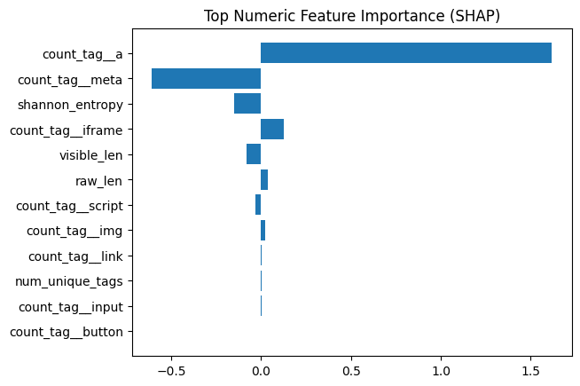

# DExPhish: explainable phishing webpage detection

A phishing detector that reads the page itself, not just the URL, and shows which features drove each verdict.

Most phishing filters score the URL. That is easy to dodge with a fresh domain. DExPhish fetches the page HTML and combines two views of it:

- **Structure:** tag counts (links, forms, inputs, scripts, iframes, images, meta), Shannon entropy of the HTML, maximum DOM depth, and raw and visible text length.
- **Meaning:** XLM-RoBERTa embeddings (768 dimensions, mean pooled) of the visible text and of the tag sequence.

The two are concatenated and passed to a classifier tuned with a randomised search (XGBoost, with a random forest fallback). SHAP then explains each prediction in terms of the structural features.

```
webpage HTML
   |-- HTML parser ----> structural features (tag counts, entropy, DOM depth, text length)
   |-- XLM-RoBERTa ----> text and tag sequence embeddings
   `-- concatenate ----> tuned classifier ----> phishing probability + SHAP explanation
```

## Results

Measured in `notebook.ipynb` on the validation split of the Kaggle dataset "Phishing Website HTML Classification".

| Metric | Value |
|---|---|
| Accuracy | 0.967 |
| Precision | 0.965 |
| Recall | 0.953 |
| F1 | 0.959 |
| ROC AUC | 0.995 |

These are the numbers the notebook prints. There is no ablation study in this repository, so no comparison against URL only or text only baselines is claimed here.

## Explanations

The notebook fetches a live URL, scores it, and plots the SHAP contribution of each structural feature. One real example from the notebook:



A decision threshold of 0.20 is used at inference, chosen to favour recall: missing a phishing page costs more than a false alarm.

## Run it

Open `notebook.ipynb` on Kaggle with the dataset attached, or locally with a GPU for the embedding step.

```bash
pip install transformers torch scikit-learn xgboost shap beautifulsoup4 pandas tqdm
```

## Stack

Python, Hugging Face Transformers (XLM-RoBERTa), scikit-learn, XGBoost, SHAP, BeautifulSoup.

## Research

Submitted to ICIT 2025.

## License

Apache-2.0
